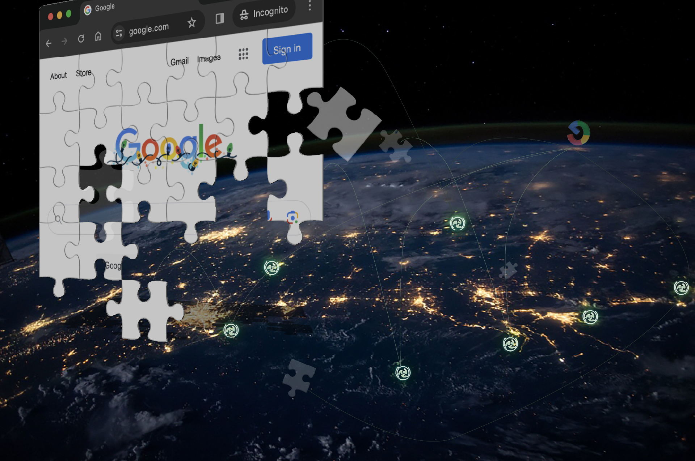

# CONET Power Card

<figure><figcaption></figcaption></figure>

CONET provides a credit card-sized, ultra-thin personal WiFi smart hardware device, measuring only as thick as six credit cards combined. This device can be conveniently placed in a wallet, offering users seamless network transmission and robust privacy protection within its network coverage radius. Additionally, it can serve as a CONET onboarding device provider, allowing users to earn additional income.

**Technical Specifications:**

* **Wireless WiFi:** 802.11a, b, n
* **Chip:** 2x Qualcomm 64-bit Core
* **Operating System:** Optimized Custom Debian
* **Optional Storage Capacity:** 512GB/1TB
* **Battery:** Longest working time up to 24 hours, one-week standby
* **Charging:** Wireless charging, compatible with any wireless charger
* **CONET Agent:** Native support for CONET agent service, ensuring private and unrestricted internet access
* **Privacy Storage Protocol:** Supports CONET's unique fragmented encryption
* **Password Protection Protocol:** Utilizes anti-brute-force Scrypt-derived protocol, generating a 256-bit high-strength password protection from a simple client-side password
* **Hardware Wallet Technology:** Private keys are stored in a fragmented encrypted manner, making it impossible for attackers to locate the private keys even if they breach CONET hardware devices.

**Physical Specifications:**

* **Size:** 5cm x 9cm x 0.6cm (2 x 3.5 x 0.25 in)
* **Weight:** 50g (1.6 oz)
* **Material:** Super ceramic crystal panel
* **External Buttons, Ports:** No interfaces or buttons
* **Dust and Waterproofing:** Fully enclosed structure, super waterproof and dustproof
* **Other:** Complies with US Department of Energy requirements, made of 100% environmentally friendly renewable materials.
