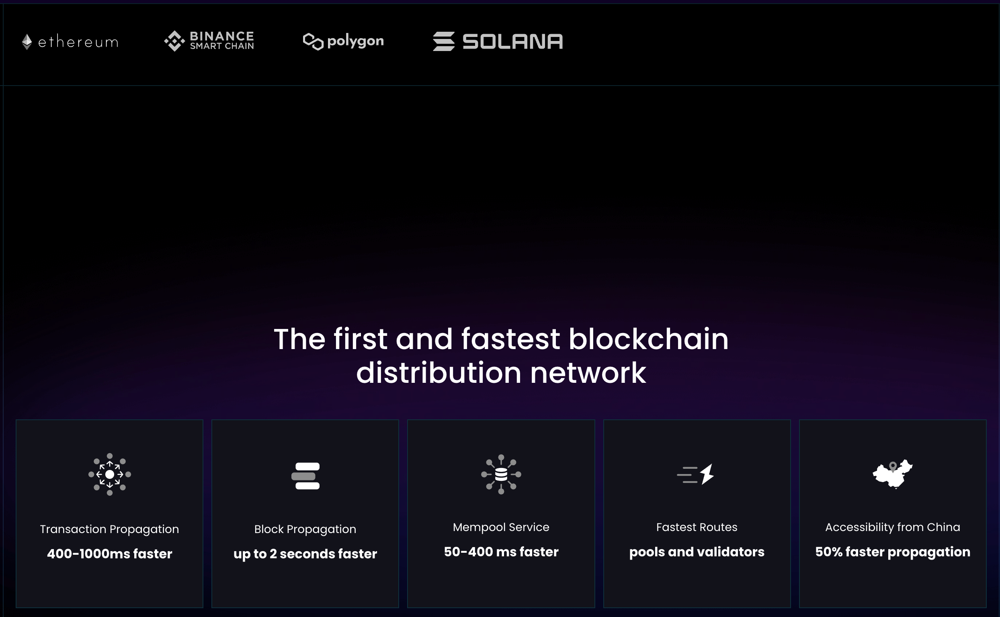

# Decentralized Physical Infrastructure Network

The CONET infrastructure consists of the following key components:

1. **Participant-Owned Shared Economy**: Participants contribute essential nodes and functionalities to the CONET network by providing physical equipment such as CPUs, memory, storage space, bandwidth, WiFi hotspots, 5G, etc. Through their honest and high-quality services, they earn rewards, forming a community of shared destiny.
2. **Consensus Protocol for Incentive Distribution**: To maintain the proper functioning of the CONET dedicated network (DCPN), a transparent, open, and fair economic distribution mechanism is required. Well-behaved participants receive expected incentives, while users pay corresponding network usage fees.
3. **Consumer Shared Economy**: Users benefit from the Layer Minus network's underlying protocol, gaining advantages in decentralized Web3. This includes both end-users and commercial users. Independent end-users enjoy decentralized ownership of data, privacy, and anonymity through the Layer Minus protocol, along with secure and unrestricted internet access and decentralized finance with autonomous accounts. Commercial users, using the Layer Minus protocol, can establish an economic system that prioritizes end-user experiences without being confined to the Web2 model controlled by advertising clients. The Layer Minus communication protocol's inherent feature of no registration protects the security of end-users' encrypted assets.
4. **Code Sharing Economy**: CONET is built on completely transparent and open-source code. The community of users contributes to bug reports, suggestions for improving user experience, and innovative ideas. The quality supervision and security audit of the code are collaborative efforts of the entire community. Sustainable development of the CONET Layer Minus network relies on continuous code output from developers. They consider it their mission to help commercial users who are struggling with Web2 to easily embrace Web3 opportunities at a low cost. CONET aims to establish a community for sharing the economy of developer code through token distribution and incentive mechanisms.
5. **Blockchain Ledger Infrastructure**: This ensures the recording of events, device registrations, task statistics, and fair distribution of points on the CONET Layer Minus network through public transparency and tamper-resistant mechanisms.
6. **DePIN Flywheel**: The DePIN flywheel represents the momentum and growth of the decentralized private network, reflecting the continuous evolution and advancement of the CONET infrastructure.

<figure><figcaption></figcaption></figure>

The project progress is outlined as follows:

1. **Project Initiation Investigation and Research**: Completed
2. **Project Launch Funding**: Completed
3. **Platform Development**: CONET Platform v1 - Completed
4. **Third-Party dAPPs**: CONET Proxy v1, CONET Browser Beta - Completed
5. **Open Community Construction**: Ongoing development of miner participants and user engagement.
