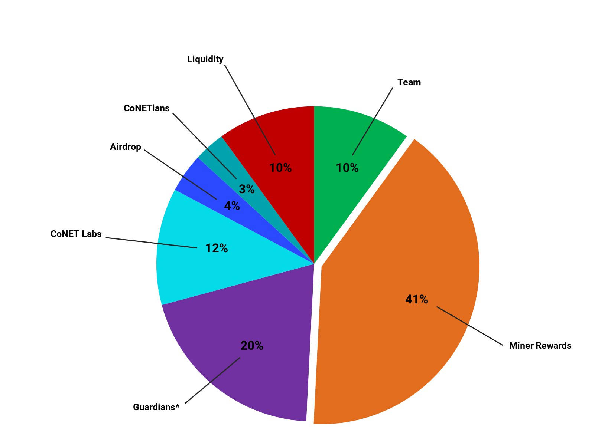
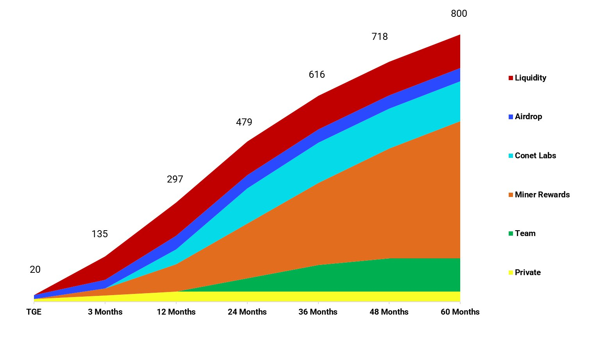

# Token Distribution

### **Token Distribution & Emissions Overview**

This section outlines CoNET's token allocation across key areas, ensuring resources are directed toward ecosystem growth, community incentives, and network security. The distribution plan supports CoNET’s long-term vision by strategically balancing resources between development, rewards, and liquidity.

<figure><figcaption></figcaption></figure>

### Token Allocation Breakdown:

* 3% – Conetian: Reserved for early-stage investors to onboard and support the foundational growth of CoNET.
* 20% – Guardians: Dedicated to supporting nodes. WIl be a lockdrop for 5 years and after will be released with 12 months vesting. \
  This will ensure long-term commitment.
* 10% – Team Allocation: Reserved to incentivize and reward team members for their contributions to CoNET’s success.
* 41% – Miner Rewards: Allocated to incentivize Miners and Relay Node participants, rewarding activity and supporting the ecosystem’s sustainability.
* 12% – CoNET Labs: To be used for ongoing development and to incentivize dAPP builders, fueling growth and innovation.
* 4% – Airdrops: Reserved for rewarding early adopters and fostering ecosystem participation during the initial stages.
* 10% – Liquidity: Allocated for usage on decentralized and centralized exchanges (DEX & CEX) to ensure healthy market liquidity.

<figure><figcaption></figcaption></figure>

### **Emissions**

Token emissions refer to the release of tokens from the treasury into the circulating supply. Emissions schedules are important for understanding potential selling pressure, especially from fundraising rounds, as these often introduce tokens that may be sold when they become available. \
However, not all token tranches are sold immediately upon unlocking. \
\
For example, tokens allocated for marketing, ecosystem development, and similar categories may be unlocked but strategically held for future use.

The graphs below illustrate our emission schedule. \
Here, ‘emissions’ specifically means releasing minted tokens from the treasury (the total of all unreleased tokens in each respective category) into the circulating supply.\
In simple terms:\
**Circulating Supply + Treasury = Total Supply**

## Token Generation Event TBA
